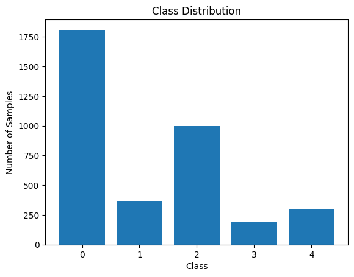

# Diabetic Retinopathy Detection using Transfer Learning (ResNet-18)

This project implements an **AI-based system** to detect and classify **Diabetic Retinopathy (DR)** from retinal fundus images. Diabetic Retinopathy is a diabetes complication that can cause blindness if not diagnosed early. Manual detection is time-consuming and error-prone.

This project automates DR stage classification into five severity levels, supporting clinicians in early diagnosis. It leverages **transfer learning with ResNet-18**, preprocessing, data augmentation, class imbalance handling, and **Grad-CAM** for model interpretability.

## Project Structure 

Diabetic-Retinopathy-Detection/  
│── Diabetic-Retinopathy-Detection.ipynb  # Source code
│── aptos2019-blindness-detection/ # Dataset
│ ├── test_images/
│ ├── train_images/
│ ├── test.csv
│ └── train.csv
│── preprocessed_data/  # To store preprocessed images
│ ├── test_images/
│ └── train_images/
│── organized_dataset  # class-specific folders
│ ├── 0/
│ ├── 1/
│ ├── 2/
│ ├── 3/
│ └── 4/

## Dataset
The dataset used is the [APTOS 2019 Blindness Detection](https://www.kaggle.com/competitions/aptos2019-blindness-detection/data) dataset, provided by the Asia Pacific Tele-Ophthalmology Society (APTOS) as part of a Kaggle competition.

The dataset contains:
- **3,662 training images** of retina scans, labeled with one of five classes indicating the severity of diabetic retinopathy
- **1,928 test images** without labels (used for competition scoring)

Severity levels (clinician-labeled):
- **Class 0:** No DR
- **Class 1:** Mild
- **Class 2:** Moderate
- **Class 3:** Severe
- **Class 4:** Proliferative DR

## Challenges

### Class Imbalance
The majority of images belong to Class 0, while Classes 3 and 4 are underrepresented.  
This imbalance makes the model biased toward the majority class.



### Image Quality Variability
Fundus images vary in brightness, contrast, and sharpness, making preprocessing essential for effective training.

## Preprocessing

1. **Converting the image to RGB**  
   Most deep learning models (like ResNet) expect images in RGB format. OpenCV loads images as BGR, so conversion ensures consistency.  

2. **Resizing to 224×224**  
   ResNet-18 requires input of **224×224 pixels**.  

3. **Contrast Enhancement with CLAHE**  
   CLAHE (Contrast Limited Adaptive Histogram Equalization) enhances local contrast and highlights fine details in blood vessels.  

4. **Gaussian Blur**  
   Reduces noise while preserving key structures.  

5. **Saving Preprocessed Dataset**  
   Images were preprocessed and stored for reuse.  

6. **Dataset Organization**  
   Preprocessed images were placed into class-specific subfolders (`0–4`) for training and evaluation.  


| Before Preprocessing | After Preprocessing |
|---------|---------|
|  |  |

## Data Augmentation
To improve generalization and reduce overfitting:  
- Random Horizontal Flip
- Random Rotation (±10°) 
- Normalization using ImageNet mean & std  

Validation images were only resized and normalized (no random augmentation).

## Model: ResNet-18 with Transfer Learning

### ResNet-18
   
ResNet-18 is used because the model is lightweight compared to deeper variants (ResNet-50/101), works well with smaller medical datasets and skip connections prevent vanishing gradients. 

### Transfer Learning
Training a deep CNN from scratch requires millions of images, but medical datasets like APTOS 2019 are relatively small (~3.6k images).  
To overcome this, we used transfer learning:
- Start with a **ResNet-18 model pretrained on ImageNet** (1.2M images, 1000 classes). 
- The early convolutional layers reuses already learned general visual features like edges, colors, textures, gradients, object parts and shapes.
- Replace the final fully connected layer (fc) to with a new one that outputs **5 classes** (DR severity levels).
  ```python
  model.fc = nn.Linear(model.fc.in_features, 5)
- Unlike feature extraction (where pretrained layers are frozen), here the entire network was **fine-tuned end-to-end** with a small learning rate (Adam optimizer, lr=0.001). This allowed the pretrained convolutional filters to adapt from generic ImageNet features (edges, textures, shapes) to retinal lesion patterns specific to diabetic retinopathy.

This approach makes training faster, reduces the risk of overfitting, and improves performance on small datasets.

## Training Strategy
- **4-Fold Cross Validation** for robust evaluation  
- Each fold trained independently and results averaged
   - Forward Pass: 
      Input batch → ResNet → predicted logits → softmax → probabilities
   - Loss Calculation:
      CrossEntropyLoss (with class weights) compares predictions vs true labels.
   - Backward Pass (Backpropagation):
      - Compute gradients using loss.backward().
      - Optimizer (Adam with lr=0.001) updates weights.
   - Validation Phase:
      - After each epoch, evaluate on validation fold.
      - Metrics (Accuracy, Precision, Recall, F1, ROC-AUC) are logged.
   - Repeat for epochs (until convergence).
- Finally, metrics are averaged across all folds to report stable results.  
- **Grad-CAM** used to visualize attention regions on retinal images

## Results

For detailed results and plots, see [full results](results/results.md).


##### Aggregated evaluation metrics across 4 folds

| Metric      | Mean  | Std Dev |
|-------------|-------|---------|
| Accuracy    | 0.7589 | 0.0187   |
| Precision   | 0.6383 | 0.0279   |
| Recall      | 0.6034 | 0.0300   |
| F1-Score    | 0.6039 | 0.0345   |
| ROC-AUC     | 0.9286 | 0.0104   |

- **Class 0 (No DR):** Very high precision & recall (~0.90+)  
- **Classes 3 & 4 (Severe/Proliferative DR):** Lower recall due to imbalance  
- **Overall:** The model generalizes well but struggles with minority classes  

##### Confusion matrix for all folds:  


## Grad-CAM Visualization
Grad-CAM highlights regions in fundus images that influenced predictions. This improves interpretability and helps clinicians trust the model.


## Notebook
The complete code, training, evaluation, and visualizations are in this Jupyter Notebook:  
👉 [Diabetic-Retinopathy-Detection.ipynb](Diabetic-Retinopathy-Detection.ipynb)

You can open it directly in Google Colab:  
[](https://colab.research.google.com/github/your-username/diabetic-retinopathy-detection/blob/main/Diabetic-Retinopathy-Detection.ipynb)

## How to Run
1. Clone this repo  
   ```bash
   git clone https://github.com/your-username/diabetic-retinopathy-detection.git
   cd diabetic-retinopathy-detection
2. Download the dataset
3. Open the notebook in Jupyter/Colab
4. Run all cells to reproduce results

## Dependencies

This project was developed and tested using Python 3.10 with the following libraries:

- torch >= 2.0
- torchvision >= 0.15
- opencv-python
- pandas
- scikit-learn
- matplotlib
- seaborn

Install all dependencies with:
```bash
   pip install torch torchvision opencv-python pandas scikit-learn matplotlib seaborn
```

## Future Work

While the current model achieves strong performance, there are several areas for improvement:

- **Class Imbalance Handling (High Priority):** The dataset is heavily skewed toward Class 0 (No DR). Future work could explore oversampling, undersampling, SMOTE, or focal loss to improve recall for minority classes (Severe and Proliferative DR).
- **Model Architectures:** Experiment with deeper CNNs (ResNet-50, EfficientNet) or ensemble methods for improved accuracy.
- **Hyperparameter Tuning:** Explore different learning rates, optimizers, and scheduler strategies.
- **Explainability:** Extend Grad-CAM with layer-wise relevance propagation or SHAP for richer interpretability.

