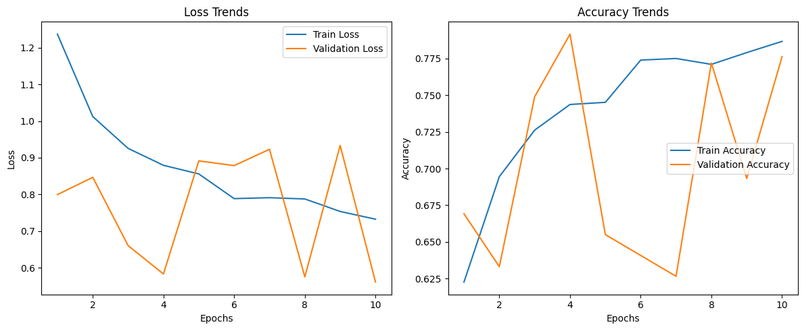
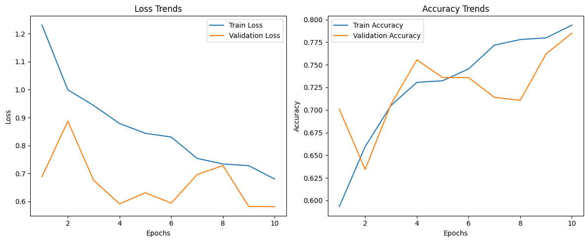
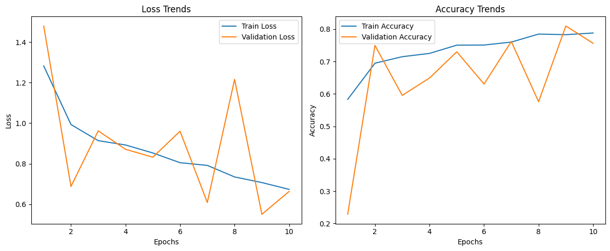
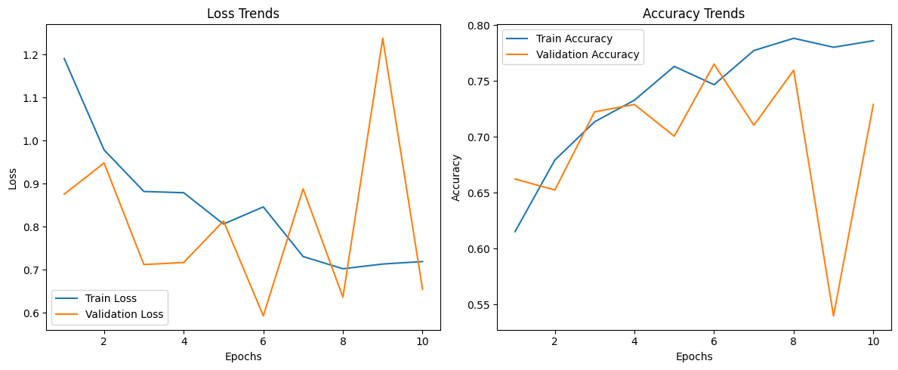
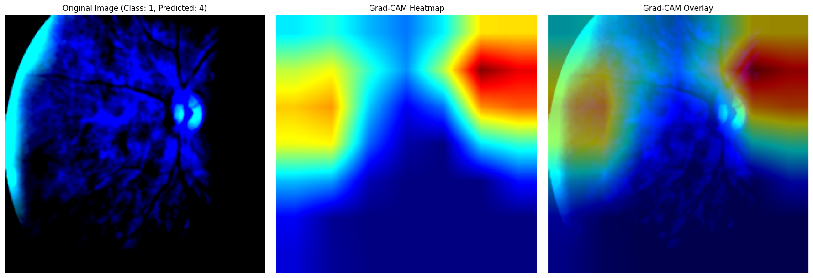
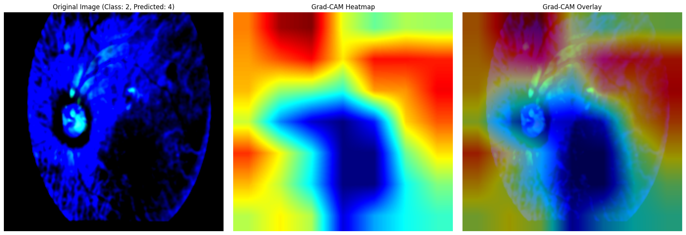
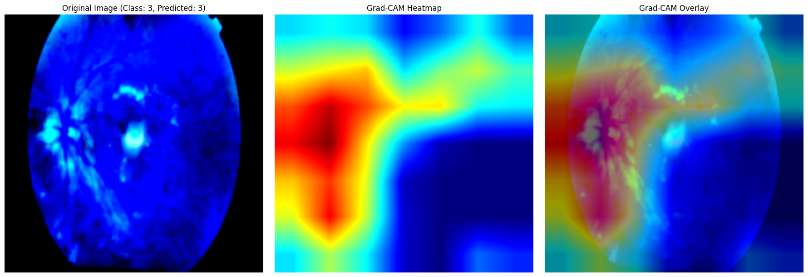
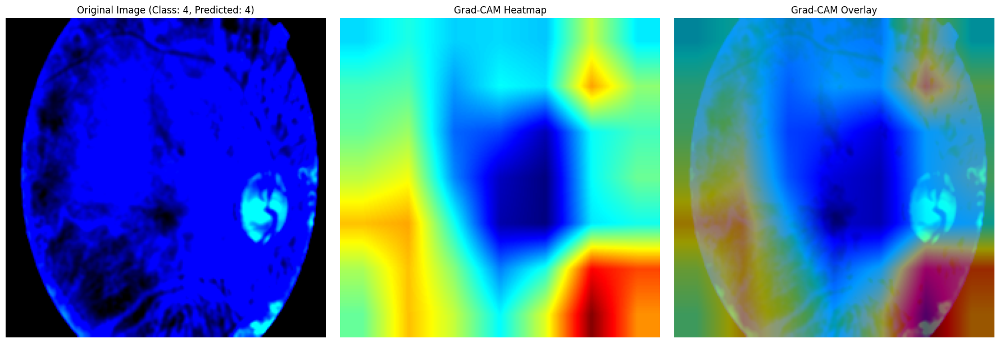

## 📊 Results

### Training and Validation Accuracy and Loss

| Fold | Epoch | Train Accuracy | Val Accuracy | Train Loss / Val Loss |
|------|-------|----------------|--------------|-----------------------|
| 1    | 1     | 62.27%         | 66.92%       | 1.2368 / 0.7994       |
| 1    | 10    | 78.66%         | 77.62%       | 0.7324 / 0.5611       |
| 2    | 1     | 59.32%         | 70.09%       | 1.2312 / 0.6882       |
| 2    | 10    | 79.39%         | 78.49%       | 0.6799 / 0.5812       |
| 3    | 1     | 58.32%         | 22.84%       | 1.2824 / 1.4794       |
| 3    | 10    | 78.81%         | 75.63%       | 0.6374 / 0.6631       |
| 4    | 1     | 61.52%         | 66.23%       | 1.1904 / 0.8755       |
| 4    | 10    | 78.59%         | 72.90%       | 0.7190 / 0.6545       |

##### Fold 1
 
##### Fold 2
 
##### Fold 3
 
##### Fold 4
 

### Evaluation Metrics

##### Fold-wise Performance Metrics:

| Fold | Accuracy | Precision | Recall | F1-Score | ROC-AUC |
|------|----------|-----------|--------|----------|---------|
| 1    | 0.7838   | 0.6471    | 0.6801 | 0.6566   | 0.9431  |
| 2    | 0.7697   | 0.5655    | 0.6028 | 0.5627   | 0.9318  |
| 3    | 0.7443   | 0.6116    | 0.6418 | 0.6086   | 0.9251  |
| 4    | 0.7377   | 0.5893    | 0.6285 | 0.5876   | 0.9145  |

##### Aggregated metrics across 4 folds:

| Metric      | Mean  | Std Dev |
|-------------|-------|---------|
| Accuracy    | 0.7589 | 0.0187   |
| Precision   | 0.6383 | 0.0279   |
| Recall      | 0.6034 | 0.0300   |
| F1-Score    | 0.6039 | 0.0345   |
| ROC-AUC     | 0.9286 | 0.0104   |

- **Accuracy (76%):** Most predictions are correct, but inflated by the dominant Class 0
- **Precision (64%):** Predictions are fairly reliable; few false alarms
- **Recall (60%):** The model misses ~40% of actual diseased cases in minority classes
- **F1-score (60%):** Balanced view — highlights the difficulty with Classes 3 & 4
- **ROC-AUC (0.93):** Strong ability to distinguish between DR stages, even if classification is not always perfect
- **Class 0 (No DR):** Very high precision & recall (~0.90+)  
- **Classes 3 & 4 (Severe/Proliferative DR):** Lower recall due to imbalance  
- **Overall:** The model generalizes well but struggles with minority classes  

##### Confusion matrix for all folds:  
  

### Grad-CAM Visualization
Grad-CAM highlights regions in fundus images that influenced predictions. This improves interpretability and helps clinicians trust the model.

 
 
 
 
  
